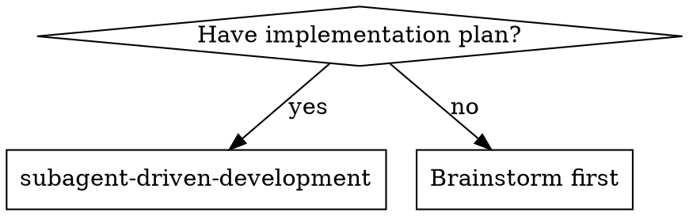
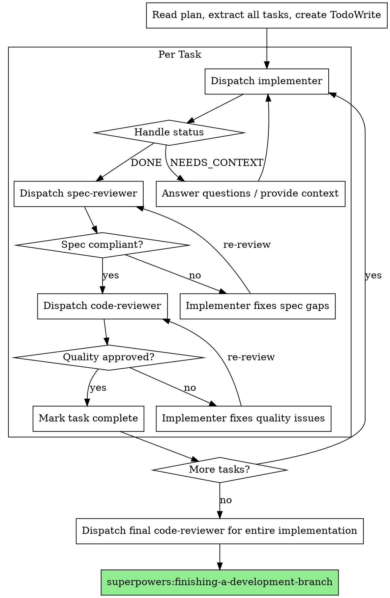

# Subagent-Driven Development

Execute plan by dispatching fresh subagent per task, with two-stage review after each: spec compliance review first, then code quality review.

**Why subagents:** You delegate tasks to specialized agents with isolated context. By precisely crafting their instructions and context, you ensure they stay focused and succeed at their task. They should never inherit your session's context or history — you construct exactly what they need. This also preserves your own context for coordination work.

**Core principle:** Fresh subagent per task + two-stage review (spec then quality) = high quality, fast iteration

## When to Use



## Setup: Isolated Workspace

Before executing any tasks, create an isolated worktree:

```bash
# Ensure .worktrees/ is git-ignored
git check-ignore -q .worktrees 2>/dev/null || echo '.worktrees' >> .gitignore && git add .gitignore && git commit -m "Add .worktrees to .gitignore"

# Create worktree
git worktree add .worktrees/$BRANCH_NAME -b $BRANCH_NAME
cd .worktrees/$BRANCH_NAME
```

Run project setup (npm install / cargo build / pip install / go mod download) and verify tests pass before proceeding.

## The Process



## Dispatching Subagents

Three agent types, dispatched by name via the Agent tool:

**`implementer`** — Implements a single task using TDD.
Dispatch with: task description, spec/plan paths, working directory, context about dependencies.

**`spec-reviewer`** — Verifies implementation matches spec.
Dispatch with: spec/plan paths, git range (base SHA..head SHA).

**`code-reviewer`** — Reviews code quality and production readiness.
Dispatch with: spec/plan paths, git range (base SHA..head SHA).

### Example Dispatch

```
Agent tool:
  subagent_type: implementer
  prompt: |
    Task 3: Implement user authentication endpoint

    Spec: docs/superpowers/specs/auth-spec.md
    Plan: docs/superpowers/plans/auth-plan.md
    Work from: .worktrees/feature-auth

    Context: This builds on the session middleware from Task 2.
    The database schema is already in place (see db/schema.ts).
```

```
Agent tool:
  subagent_type: spec-reviewer
  prompt: |
    Review Task 3: user authentication endpoint

    Spec: docs/superpowers/specs/auth-spec.md
    Plan: docs/superpowers/plans/auth-plan.md
    Base: abc1234
    Head: def5678
```

## Handling Implementer Status

**DONE:** Proceed to spec compliance review.

**DONE_WITH_CONCERNS:** Read the concerns. If about correctness or scope, address before review. If observations (e.g., "this file is getting large"), note and proceed.

**NEEDS_CONTEXT:** Provide missing context and re-dispatch.

**BLOCKED:** Assess the blocker:
1. If it's a context problem, provide more context and re-dispatch
2. If the task is too large, break it into smaller pieces
3. If the plan itself is wrong, escalate to the human

**Never** ignore an escalation or force retry without changes. If the implementer said it's stuck, something needs to change.

## Evaluating Reviewer Feedback

Subagent reviewers catch real issues, but they lack full session context. **Verify before implementing. Technical correctness over compliance.**

- **Correct:** Fix it, test, move on
- **Wrong (reviewer lacks context):** Note why and skip
- **Unclear:** Investigate before acting

If reviewer suggests adding unrequested features: check codebase for actual usage. If unused, skip (YAGNI).

## Red Flags

**Never:**
- Start implementation on main/master branch without explicit user consent
- Skip reviews (spec compliance OR code quality)
- Proceed with unfixed issues
- Dispatch multiple implementation subagents in parallel (conflicts)
- Skip scene-setting context (subagent needs to understand where task fits)
- Ignore subagent questions (answer before letting them proceed)
- Accept "close enough" on spec compliance
- Skip review loops (reviewer found issues = implementer fixes = review again)
- Let implementer self-review replace actual review (both are needed)
- **Start code quality review before spec compliance passes**
- Move to next task while either review has open issues

**If subagent asks questions:** Answer clearly and completely. Don't rush them.

**If reviewer finds issues:** Implementer fixes → reviewer reviews again → repeat until approved.

**If subagent fails task:** Dispatch fix subagent with specific instructions. **Don't fix manually** (context pollution).

## Integration

**Required workflow skills:**
- **superpowers:writing-plans** — Creates the plan this skill executes
- **superpowers:finishing-a-development-branch** — Complete development after all tasks
